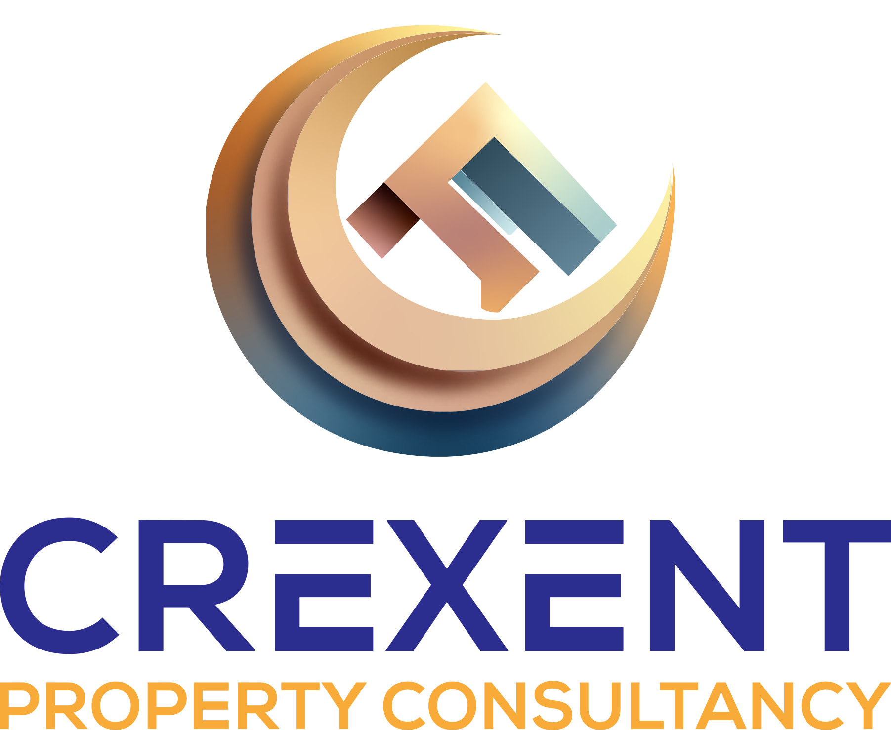

# 

<!-- This is presenter note. You can write down notes through HTML comment. -->

---

# **Our Vision**

###### *"Incorporating innovation, expertise, and a commitment to do the right thing, we envision a future where we serve as a trusted partner in the property industry, including property investors, general public, merchants, tradespersons and property agents.    We aim to empower and educate clients to make their own informed decisions without the constraints of obligation.    Our vision is to help unlock the full potential of properties, creating value and enhancing the lives of our clients and their communities."*

---

# **Our Services**

#### Our services are available to everybody
- Property Lettings/Sales Agents
- Home owners, buyer, sellers
- Landlords & Investors
- General Public

*We are able to adapt and tailor our services to the needs of the customer*

---

# **How we can help**

- Domestic EPC & Energy Reports
- Retrofit Assessment
- Surveys
- 3D Scans & Matterport Scans
- Renovation Advice & Consultancy
- Material Procurement

---
<!-- 

|        |   |
| ---------- | :----------- |
| **Reports**        | - EPC assessments   - Energy Reports  - EICR/Electrical Certificates   - Gas Safety Certificates     *Emergency Services Available* | -->

<!-- --- -->

|**Reports**|
| ---------- |
| - EPC assessments   - Energy Reports  - EICR/Electrical Certificates   - Gas Safety Certificates     *Emergency Services Available* |

---

|**Surveys**|
| ---------- |
| - Condition Surveys   - Heat loss Surveys (Thermography)   - Measurement Surveys   - Retrofit Assessments   - Route Cause Analysis|

---

|**3D Scans & Virtual Tours**|
| ---------- |
| - Matterport Scans   - 3D Point Cloud Scans   - Virtual Tours   - Exporting & hosting   - Floor Plans |
---

|**Projects & Consultancy**|
| ---------- |
| - Investment Consultancy   - Project Consultancy   - Material Procurement assistance   - Project Management   - Maintenance Contracts |
---

# **Get in touch**
[crexentpc@outlook.com](mailto:crexentpc@outlook.com)
07965 227 967 
[@crexentpc](https://x.com/crexentpc) 

